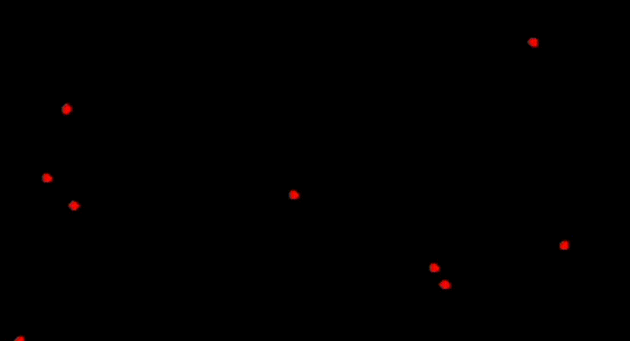

# Organism Simulation

## Description

Built to better understand the NEAT algorithm and to simulate a simple neural network that mimic the cognitive ability of primitive organism such as the C. elegans roundworm.

 
<i>Result</i>

Currently the neural network is extremely simplistic with only 2 input nodes and 2 output nodes. The goal being able to gather food efficiently by learning how to turn.

### Inputs:

- Angle difference
- Distance to food

### Outputs:

- Turn left, or right, or face forward
- Move or pause
